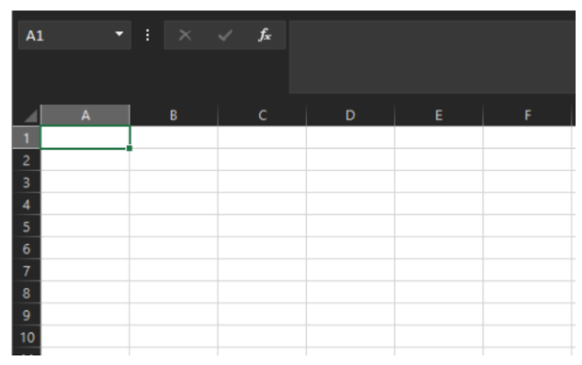

# Taller de Programación en Bajo Nivel
## Proyecto Final 1/2024

El proyecto de fin de semestre consiste en realizar en assembler de Windows, una hoja electrónica (Excel), del cual solo se implementarán siguientes funciones solamente:



- Manejo de una hoja
- Debe de manejar 6 columnas x 10 filas mínimamente
- Debe tener implementado por menú y por botones las siguientes funciones
  * Sumatorias, Promedio, Ordenamiento, y la Función (=SI)

****

### Pasos para hacer correr

1. Compilar los recursos
```hs
gorc /r excel.Rc
```

2. Compilar el codigo
```hs
fasm excel.Asm
```

3. Ejecutar la aplicacion
```hs
./excel.exe
```

#### Requisitos
* Instalar GoRC http://www.godevtool.com/GorcFrame.htm
* Instalar FASM https://flatassembler.net/
